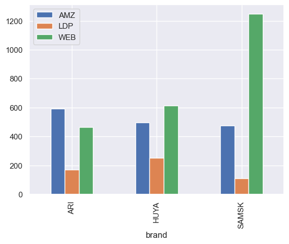
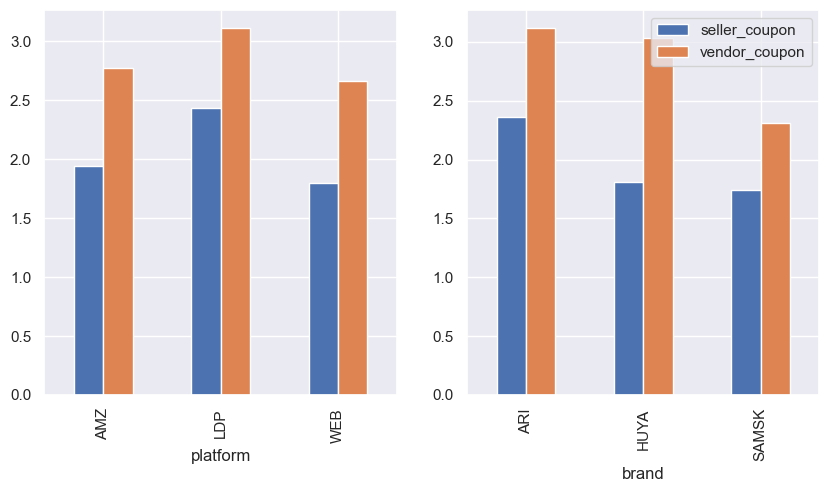
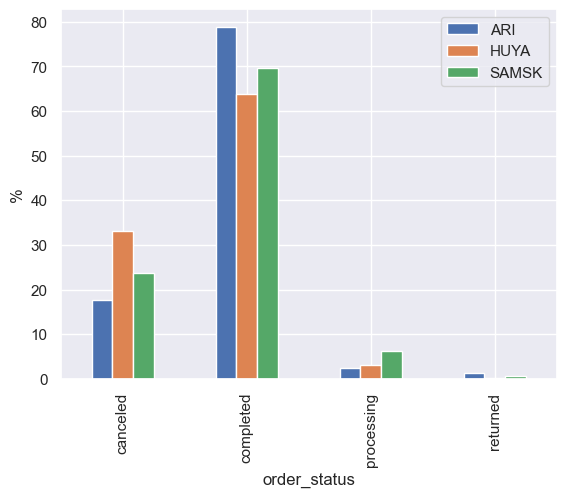
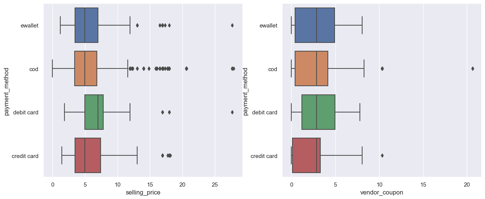
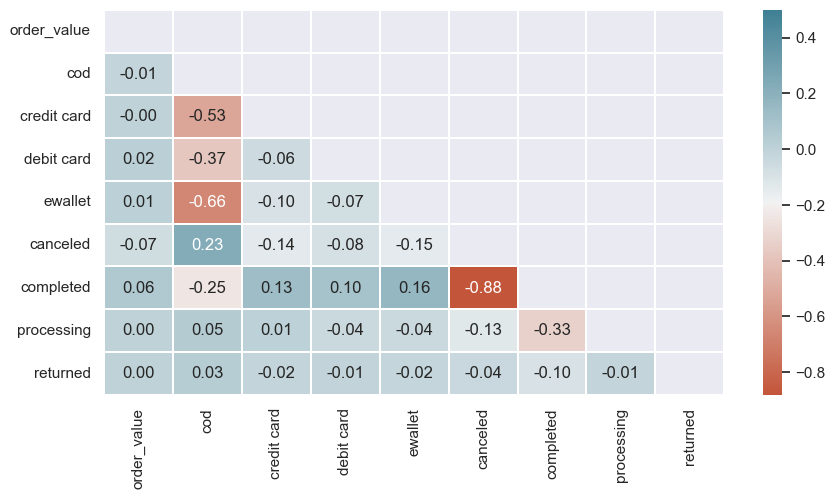
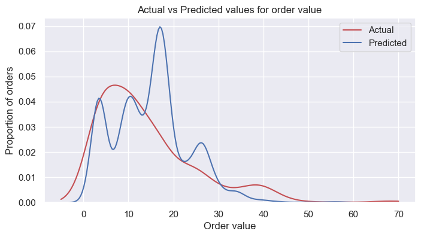

## K-Store Ecommerce Sales Order Analysis
#### Main focus: Visualizing data and fitting multiple linear regression

### 1. Import library and load data

### 2. Brief overview of the dataset
- The dataset has 10 variables with 2442 observations 
- While quantity, selling price, paid price, seller coupon, vendor coupon and order value are numeric values, others are categorical.

### 3. Data visualization
#### a. Histogram for selling price
- Histogram has 6 bins starting from low to high price. The histogram is rightly skewed, so the median selling price is less than its mean.
- The majority of observations falls into the lower price bin. 

#### b. Analyze sales quantity of each brand in 3 platforms
- The majority of SAMSK's sales volume comes from WEB platform. SAMSK should take action to improve its sales in LDP as its sales is the lowest among 3 brands.
- ARI and HUYA's sales spread out in 2 channels (AMZ and WEB). 
AMZ and WEB are the best-selling platforms for ARI and HUYA respectively.

#### c. Average amount of seller and vendor coupons used
- Among 3 platforms, sale orders in LDP have the highest average amount of seller and vendor coupons. 
- ARI is the brand that releases the largest average amount of coupons among 3 brands.

#### d. Order status of each product
- ARI is the brand with the highest order completion rate (78.83%) and lowest cancellation rate (15.59%).
- Meanwhile, HUYA has the lowest order completion rate (63.8%) and the highest cancellation rate (33.04%) among 3 brands.

#### e. Outliers in selling price, vendor coupon by order status
- Payment COD has the largest amount of outliers in selling price. 
- Vendor coupon (COD, credit card) data is negatively skewed with some outliers.

### 4. Data preprocessing
#### a. Checking missing values
Only payment method attribue contains missing data. We will process missing data in this attribute in the next section.

#### b. Transform data
- Replace null value in payment method with the most frequent value in the payment variable.
- Get dummies values for categorical variables: payment method and order_status.

#### c. Correlation coefficients between variables
Measure linear relationship between order value and order status and payment method to detect linear relationship.

### 6. Model development
#### a. Use multiple linear regression model
Use multiple linear regression model to regress order value on independent variables: quantity, selling price, seller and vendor coupon.
- The estimated model is:\
$order value = 3.02 * quantity + 1.14 selling price + 3.01 * seller coupon - 2.06 * vendor coupon + 2.06$
- The R-square: 0.263, which means 26.3% of the variation in order value can be explained by the variation in independent variables.
- Use cross validation to better fit the dataset, we get the mean R-squares as 26.8%. This is just a slight increase from previous model.
- Visualize how model fit dataset using distribution plot between actual and predicted value:

#### b. Use polynomial multiple linear regression model
Use polynomial model of degree 2 to fit data.
- The R-square: 0.293, which means that this model explains 29.3% of the variation in order value.
- Use cross validation to better fit the dataset, we get the mean R-squares as 0.282. This is just decrease comparing to the previous model.
- Visualize how model fit dataset using distribution plot between actual and predicted value:

#### c. Conclusion
Based on the reported R-square and two distribution plot, we can conclude that polynomial multiple model fit the dataset better
